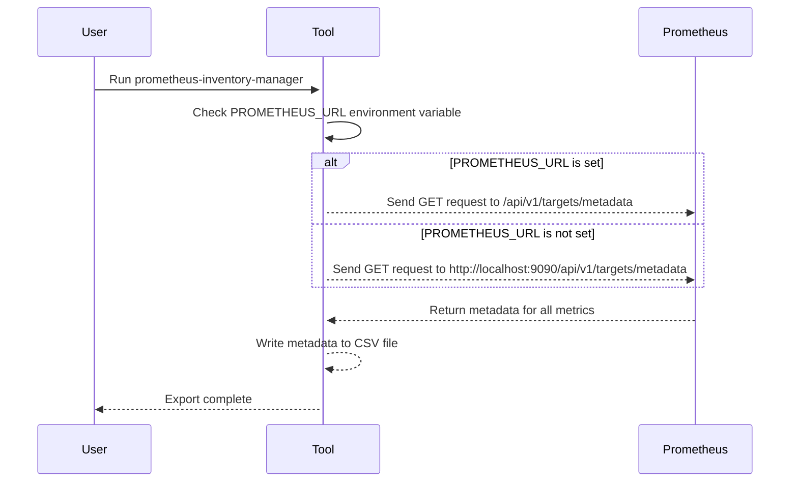
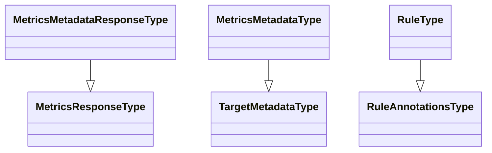

# Prometheus Inventory Manager

Prometheus Inventory Manager is a command-line tool that allows you to inventory all metrics and rules from a Prometheus server instance and export them into CSV format.

## Versioning

- v0.1.0 : 2023-03-11 : Initial release

## Running the tool

### Build binary

To run the tool from the sources, you need to have Go installed on your machine. You can download Go from [here](https://golang.org/dl/).

Once Go is installed, you can run the tool by executing the following commands:

```bash
mkdir -p binary
go build  -a  \
          -gcflags=all="-l -B" \
          -ldflags="-w -s" \
          -o binary/prometheus-inventory-manager\
          ./...
```

### From binary

```bash
binary/prometheus-inventory-manager
```


### From Docker

#### Build image

```bash
docker build -t prometheus-inventory-manager .
```

Or using `make`


#### Run image

```bash
docker run -it --rm -v $(pwd)/output:/usr/local/bin/output -e PROMETHEUS_URL=http://localhost:9090 prometheus-inventory-manager
```

Or with `docker compose`

```bash
docker-compose up
```

```text
Note:
The PROMETHEUS_URL environment variable is optional.
If it is not set, the tool will default to http://localhost:9090.
You need to update the value to reflect the URL of your Prometheus instance.
```

## Directory Mapping

- `/usr/local/bin/output`: In container
  - Contains the CSV files generated by the tool

## Output

### Metrics metadata

| instance | job | metric | type | help | unit |
|----------|-----|--------|------|------|------|
| blackbox-exporter:9115 | blackbox-exporter | process_open_fds | gauge | Number of open file descriptors. | |
| blackbox-exporter:9115 | blackbox-exporter | promhttp_metric_handler_requests_total | counter | Total number of scrapes by HTTP status code. | |
| blackbox-exporter:9115 | blackbox-exporter | go_info | gauge | Information about the Go environment. | |
| blackbox-exporter:9115 | blackbox-exporter | go_memstats_mcache_sys_bytes | gauge | Number of bytes used for mcache structures obtained from system. | |

### Alerting rules

| instance | alertname | query | summary | description | criticity |
|----------|-----------|-------|---------|-------------|-----------|
| | ProbeFailed | probe_success == 0 | Blackbox probe failed (instance {{ $labels.instance }}) | Probe failed   VALUE = {{ $value }}   LABELS: {{ $labels }} | error |
| | SlowProbe | avg_over_time(probe_duration_seconds[1m]) > 1 | Blackbox slow probe (instance {{ $labels.instance }}) | Blackbox probe took more than 1s to complete   VALUE = {{ $value }}   LABELS: {{ $labels }} | warning |
| | ProbeHttpFailure | probe_http_status_code <= 199 or probe_http_status_code >= 400 | Blackbox probe HTTP failure (instance {{ $labels.instance }}) | HTTP status code is not 200-399   VALUE = {{ $value }}   LABELS: {{ $labels }} | error |


## How it works

The tool consists of three main files:

- `main.go`: contains the main function that orchestrates the different components of the tool.
- `function.go`: contains the functions that interact with the Prometheus API to retrieve the metadata for all the metrics and rules.
- `type.go`: contains the type definitions for the different data structures used by the tool.

When the tool is executed, it first checks the `PROMETHEUS_URL` environment variable to determine the URL of the Prometheus server instance to query. If the variable is not set, the tool will default to `http://localhost:9090`.

The `GetAllMetricsMetadata` function is then called to retrieve the metadata for all the metrics from the Prometheus instance. The function sends a GET request to the `/api/v1/targets/metadata` endpoint of the Prometheus API, parses the response and returns the metadata in a `MetricsMetadataResponseType` struct.

The `GetAllAlertingRules` function is then called to retrieve the alerting rules from the Prometheus instance. The function sends a GET request to the `/api/v1/rules` endpoint of the Prometheus API, parses the response and returns the rules in an `AlertingRulesResponseType` struct.

Finally, the `WriteMetricsMetadataToCSV` function is called to export the metadata for all the metrics to a CSV file named `metrics.csv` in the `output` directory.


### Diagram



### Functions

- `SetInsecureSSL()` This function sets the `InsecureSkipVerify` field of the TLS config to true, which allows the tool to ignore SSL certificate validation errors. This function is used in the `ApiCaller` function to allow connections to Prometheus instances with self-signed certificates.

- `ApiCaller(url string, method string, body io.Reader, headers map[string]string) ([]byte, int, error)` This function sends an HTTP request to a given URL with the specified method and body and returns the response body, status code and error (if any). This function is used to interact with the Prometheus API.

- `GetAllMetricsMetadata(prometheusURL string) MetricsMetadataResponseType` This function retrieves the metadata for all the metrics from a given Prometheus instance by sending a GET request to the `/api/v1/targets/metadata` endpoint of the Prometheus API. The function returns a `MetricsMetadataResponseType` struct containing the metadata for each metric.

- `GetAllAlertingRules(prometheusURL string) AlertingRulesResponseType` This function retrieves the alerting rules from a given Prometheus instance by sending a GET request to the `/api/v1/rules` endpoint of the Prometheus API. The function returns an `AlertingRulesResponseType` struct containing the rules.

-  `WriteMetricsMetadataToCSV(metricsMetadata MetricsMetadataResponseType, filename string) error` This function writes the metadata for all the metrics to a CSV file named `metrics.csv` in the `output` directory. The function takes a `MetricsMetadataResponseType` struct as input and returns an error if the file cannot be created or if there is an error while writing the data.

### Types

- `MetricsResponseType`: This type represents the response from the `/api/v1/targets/metadata` endpoint of the Prometheus API. It contains a `Status` field with the status of the response and a `Data` field with an array of `MetricsNamesType` strings representing the names of the metrics.

- `MetricsNamesType`: This type is a string

- `MetricsMetadataResponseType`: This type represents the response from the /api/v1/targets/metadata endpoint of the Prometheus API when requesting metadata for all the metrics. It contains a Status field with the status of the response and a Data field with an array of MetricsMetadataType structs representing the metadata for each metric.

- `MetricsMetadataType`: This type represents the metadata for a single metric. It contains a Target field with the instance and job labels of the metric, a Metric field with the name of the metric, a Type field with the type of the metric, a Help field with the help string of the metric, and a Unit field with the unit of the metric.

- `TargetMetadataType`: This type represents the instance and job labels of a metric.

- `AlertingRulesResponseType`: This type represents the response from the /api/v1/rules endpoint of the Prometheus API when requesting alerting rules. It contains a Data field with an array of Groups structs representing the alerting rule groups.

- `RuleType`: This type represents an alerting rule. It contains an array of Alerts structs representing the active alerts for the rule, an Annotations field with the annotations of the rule, a Health field with the health status of the rule, a Labels field with the labels of the rule, a Name field with the name of the rule, a Query field with the query of the rule, a Type field with the type of the rule, a Duration field with the duration of the rule, a Groups field with the groups of the rule, and a LastExecuted field with the timestamp of the last execution of the rule.

- `RuleAnnotationsType`: This type represents the annotations of an alerting rule. It contains a Description field with the description of the rule and a Summary field with the summary of the rule.

- `RuleLabelsType`: This type represents the labels of an alerting rule. It contains a Severity field with the severity of the rule.

- `AlertType`: This type represents an active alert for an alerting rule. It contains an ActiveAt field with the timestamp of when the alert became active, an Annotations field with the annotations of the alert, a Labels field with the labels of the alert, a State field with the state of the alert, and a Value field with the value of the alert.

### Type Diagram



## External libraries

- [charmbracelet/log](https://github.com/charmbracelet/log): Used to log messages to the console
- [charmbracelet/vhs](htps://github.com/charmbracelet/vhs): Used to create gifs for this README
