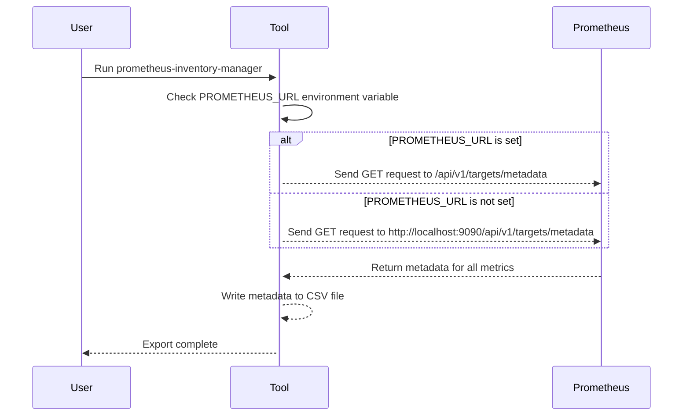

# Prometheus Inventory Manager

Prometheus Inventory Manager is a command-line tool that allows you to inventory all metrics and rules from a Prometheus server instance and export them into CSV format.

## Versioning

- v1.0.0 : 2023-03-12 : Initial stable release
- v0.1.0 : 2023-03-11 : Initial release

## Running the tool

### Build binary

To run the tool from the sources, you need to have Go installed on your machine. You can download Go from [here](https://golang.org/dl/).

Once Go is installed, you can run the tool by executing the following commands:

```bash
mkdir -p binary
go build  -a  \
          -gcflags=all="-l -B" \
          -ldflags="-w -s" \
          -o binary/prometheus-inventory-manager\
          ./...
```

### From binary

```bash
binary/prometheus-inventory-manager
```


### From Docker

#### Build image

```bash
docker build -t prometheus-inventory-manager .
```

Or using `make`


#### Run image

```bash
docker run -it --rm -v $(pwd)/output:/usr/local/bin/output -e PROMETHEUS_URL=http://localhost:9090 prometheus-inventory-manager
```

Or with `docker compose`

```bash
docker-compose up
```

```text
Note:
The PROMETHEUS_URL environment variable is optional.
If it is not set, the tool will default to http://localhost:9090.
You need to update the value to reflect the URL of your Prometheus instance.
```

## Directory Mapping

- `/usr/local/bin/output`: In container
  - Contains the CSV files generated by the tool

## Output

### Metrics metadata

| instance | job | metric | type | help | unit |
|----------|-----|--------|------|------|------|
| blackbox-exporter:9115 | blackbox-exporter | process_open_fds | gauge | Number of open file descriptors. | |
| blackbox-exporter:9115 | blackbox-exporter | promhttp_metric_handler_requests_total | counter | Total number of scrapes by HTTP status code. | |
| blackbox-exporter:9115 | blackbox-exporter | go_info | gauge | Information about the Go environment. | |
| blackbox-exporter:9115 | blackbox-exporter | go_memstats_mcache_sys_bytes | gauge | Number of bytes used for mcache structures obtained from system. | |

### Alerting rules

| instance | alertname | query | summary | description | criticity |
|----------|-----------|-------|---------|-------------|-----------|
| | ProbeFailed | probe_success == 0 | Blackbox probe failed (instance {{ $labels.instance }}) | Probe failed   VALUE = {{ $value }}   LABELS: {{ $labels }} | error |
| | SlowProbe | avg_over_time(probe_duration_seconds[1m]) > 1 | Blackbox slow probe (instance {{ $labels.instance }}) | Blackbox probe took more than 1s to complete   VALUE = {{ $value }}   LABELS: {{ $labels }} | warning |
| | ProbeHttpFailure | probe_http_status_code <= 199 or probe_http_status_code >= 400 | Blackbox probe HTTP failure (instance {{ $labels.instance }}) | HTTP status code is not 200-399   VALUE = {{ $value }}   LABELS: {{ $labels }} | error |


## How it works

The tool consists of three main files:

- `main.go`: contains the main function that orchestrates the different components of the tool.
- `function.go`: contains the functions that interact with the Prometheus API to retrieve the metadata for all the metrics and rules.
- `type.go`: contains the type definitions for the different data structures used by the tool.

When the tool is executed, it first checks the `PROMETHEUS_URL` environment variable to determine the URL of the Prometheus server instance to query. If the variable is not set, the tool will default to `http://localhost:9090`.

The `GetAllMetricsMetadata` function is then called to retrieve the metadata for all the metrics from the Prometheus instance. The function sends a GET request to the `/api/v1/targets/metadata` endpoint of the Prometheus API, parses the response and returns the metadata in a `MetricsMetadataResponseType` struct.

The `GetAllAlertingRules` function is then called to retrieve the alerting rules from the Prometheus instance. The function sends a GET request to the `/api/v1/rules` endpoint of the Prometheus API, parses the response and returns the rules in an `AlertingRulesResponseType` struct.

### Diagram



## External libraries

- [charmbracelet/log](https://github.com/charmbracelet/log): Used to log messages to the console
- [charmbracelet/vhs](htps://github.com/charmbracelet/vhs): Used to create gifs for this README
